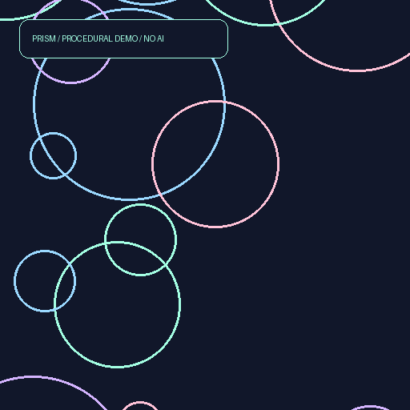

# Prism Studio

A local image-generation workbench that keeps the experiment with the image.

Prism Studio turns a small Stable Diffusion demo into a packaged application: a shared SDXL backend, command-line and Streamlit interfaces, deliberate device selection, reproducible dependencies, and a JSON record of every run. Built by Elliott Barnes.

[Open the interactive browser workbench](https://elliottbarnes.github.io/prism-studio/).
Change a seed and canvas size, render a procedural SVG, inspect/download its JSON manifest,
and copy a validated command for the Python demo. The page runs entirely in the browser.
It does not load SDXL, send prompts, or request credentials.

## Try the workflow without a GPU

Requires Python 3.11–3.13 and [uv](https://docs.astral.sh/uv/getting-started/installation/). The committed lock was generated with uv 0.12.17. These commands install the UI but **do not install torch or download model weights**:

```sh
git clone https://github.com/elliottbarnes/prism-studio.git
cd prism-studio
uv sync --frozen --extra ui
PRISM_DEMO=1 uv run --frozen --extra ui streamlit run generate_image_streamlit.py
```

Open the localhost URL. Describe an image, set a seed, and choose **Make a preview**. The demo intentionally draws labeled procedural shapes; it does not interpret your prompt or demonstrate model quality. You can download a PNG and its manifest and exercise the entire workflow offline after installation.

```sh
uv run --frozen prism "Try the workflow" --demo --seed 42 --width 512 --height 512
```



The [example manifest](docs/examples/manifest.json) is generated from that actual demo run. The repository's original [generated_image.png](generated_image.png) is preserved as a legacy sample; its prompt and settings were not recorded, so it is not evidence of the new SDXL backend.

## Generate with SDXL

Install inference dependencies only when you are ready. Model weights require **several GB of download and disk space**, plus substantial RAM/VRAM. Generation runs on your computer; there is no paid inference API. Package installation and an uncached model load contact public registries/Hugging Face.

```sh
uv sync --frozen --extra ui --extra inference
uv run --frozen --extra ui --extra inference streamlit run generate_image_streamlit.py

uv run --frozen --extra inference prism \
  "A tiny observatory above a sea of clouds, soft morning light, editorial illustration" \
  --seed 42 --steps 30 --device cuda --cpu-offload
```

The baseline is `stabilityai/stable-diffusion-xl-base-1.0`, pinned to commit `462165984030d82259a11f4367a4eed129e94a7b`. SDXL is a mature, well-documented baseline, **not a claim to be today's most capable model**. It keeps the project inspectable without introducing gated-model terms, multiple backends, or a second refiner's memory cost. The [model card](https://huggingface.co/stabilityai/stable-diffusion-xl-base-1.0) documents standalone base-model use, limitations and the CreativeML Open RAIL++-M model license. The application's MIT license does not replace model terms.

### Hardware policy

| Selection | Precision | Behavior |
| --- | --- | --- |
| `auto` | Resolved below | CUDA first, then Apple MPS, then CPU |
| `cuda` | float16 by default | FP16 weights; optional `--cpu-offload` via Accelerate |
| `mps` | float32 | Conservative Apple Silicon baseline; substantial unified memory needed |
| `cpu` | float32 | Functional fallback; SDXL can be very slow |

Explicit unavailable devices fail with an explanation. Float16 is restricted to CUDA in this baseline. VAE tiling is enabled; native PyTorch attention is retained. CPU offload and `.to(device)` are mutually exclusive. There is no promise that a particular RAM size will fit every setting; lower the resolution, use CUDA offload, or choose a better-equipped machine if allocation fails. See the [Diffusers memory guide](https://huggingface.co/docs/diffusers/optimization/memory) and [MPS guidance](https://huggingface.co/docs/diffusers/optimization/mps).

For Streamlit, set the runtime once per server so visitors cannot load multiple configurations:

```sh
PRISM_DEVICE=cuda PRISM_CPU_OFFLOAD=1 \
  uv run --frozen --extra ui --extra inference streamlit run generate_image_streamlit.py
```

Other server variables are `PRISM_PRECISION=auto|float16|float32` and `PRISM_LOCAL_FILES_ONLY=1`. CLI `--local-files-only` also forbids model downloads and fails when the pinned files are not cached. `--revision` accepts only an immutable 40-character commit SHA from the fixed SDXL repository. `uv run prism --help` lists all controls.

## What makes a run inspectable?

- **Fresh CPU generator per run.** A seed is not reused as mutable RNG state. Identical seeds help comparisons but cannot promise pixel identity across devices, library versions or platforms. This follows [Diffusers reproducibility guidance](https://huggingface.co/docs/diffusers/using-diffusers/reusing_seeds).
- **One model, one generation at a time.** `st.cache_resource` retains a lazy service; its lock covers loading, mutable scheduler state, inference and image encoding. This follows [Streamlit's shared-resource thread-safety requirement](https://docs.streamlit.io/develop/api-reference/caching-and-state/st.cache_resource). Results stay in each browser session; CLI output is saved explicitly.
- **Pinned, constrained loading.** Built-in `StableDiffusionXLPipeline`, fixed model repository and revision, `use_safetensors=True`, no arbitrary custom pipeline or remote code, and watermarking enabled. [Safetensors guidance](https://huggingface.co/docs/diffusers/main/using-diffusers/using_safetensors) explains the weight-format choice. The loader uses the current `dtype` argument verified against [Diffusers v0.40.0 source](https://github.com/huggingface/diffusers/blob/v0.40.0/src/diffusers/pipelines/pipeline_utils.py).
- **Bounded inputs.** Non-empty prompts; integer seeds; dimensions divisible by 64; a 1.5-megapixel cap; 1–100 steps; finite guidance values. Long prompts may still be truncated by SDXL's tokenizer. Defaults target the model's 1024-pixel workflow, described in [SDXL documentation](https://huggingface.co/docs/diffusers/main/en/using-diffusers/sdxl).
- **PNG + JSON pair.** Each CLI run gets a new UUID directory; existing runs are never overwritten. The manifest records prompt, negative prompt, seed, dimensions, steps, guidance, model/revision, scheduler/config, actual device/precision, library versions, platform, load/render time and the PNG's SHA-256 fingerprint.

```text
outputs/<run-id>/
├── image.png
└── manifest.json
```

Manifests include your prompt and platform details; review before sharing. The fingerprint checks file identity, not authorship. Watermarks are not a content moderation system. SDXL does not provide built-in content moderation in this app. The server binds to localhost by default and is intended for local creative experiments, not unreviewed public multi-user hosting.

## Develop and verify

```sh
uv sync --frozen --extra ui
uv run --frozen ruff check .
uv run --frozen ruff format --check .
uv run --frozen --extra ui python -m unittest discover -s tests -v
uv build
uv run --frozen python scripts/make_demo.py
```

Tests use injected fake model dependencies, covering validation, device selection, safetensors/revision loading, fresh RNG creation, cached/serialized calls, retries, memory errors, saved manifests, overwrite protection, demo determinism and CLI error handling. Streamlit's `AppTest` exercises real form submission, image/manifest state and invalid input. CI runs that suite on Python 3.11, 3.12 and 3.13 without torch or weights.

The SDXL integration has been checked against current upstream interfaces and a fake pipeline, **not executed with full model weights in this modernization**. There are no new image-quality or performance benchmark claims. A real GPU smoke run is the remaining integration check; use the command above and inspect the saved manifest.

`uv.lock` resolves all direct and transitive packages, including optional inference dependencies. Use `--frozen` and matching extras to reproduce an environment. PyTorch accelerator wheels and drivers remain platform-dependent: [PyTorch's install selector](https://pytorch.org/get-started/locally/) is authoritative for your machine. Do not silently mix a custom CUDA wheel into the lock; record and test an intentional lock change. `pip install -r requirements.txt` is retained for compatibility but does not enforce the transitive lock.

## Layout and history

```text
src/prism_studio/   settings, backend, service, artifacts, CLI, UI and demo
tests/             CPU-only core and Streamlit workflow checks
docs/examples/     labeled procedural PNG and actual run manifest
generate_image.py  original import API + CLI compatibility entrypoint
generate_image_streamlit.py  original UI entrypoint
uv.lock            resolved dependency environment
```

This is the continuation of `text_to_image_w_stable_diffusion`, renamed to Prism Studio. Existing Git history, MIT license and the original generated sample remain intact. The original `generate_image(prompt)` import still returns a Pillow image through the shared backend. Running that script now accepts the same arguments as `prism`, avoiding the previous implicit overwrite of `generated_image.png`.

Primary documentation was reviewed on September 18, 2026. Future upgrades should update the lock, rerun tests, and compare a fixed-seed hardware run before changing the baseline.

## Browser example

Serve `demo/` with `python -m http.server 8000 --bind 127.0.0.1 --directory demo`,
then open `http://127.0.0.1:8000`. Node 22+ runs the dependency-free checks:
`node --test tests/web/*.test.mjs`.

The browser's versioned `lcg-circles-v1` renderer is intentionally separate from the
Python Pillow demo; matching seeds do not imply pixel-identical output between them.
Shared acceptance fixtures check that both runtimes enforce the same generation
settings. Prompt, negative prompt, steps, and guidance are metadata in procedural
mode. Exported files always describe the last rendered run. No inference accuracy,
model quality, or GPU integration is established by this example.

GitHub Actions runs the existing Python checks and the browser checks before
publishing only `demo/` to GitHub Pages on a successful main-branch push.
